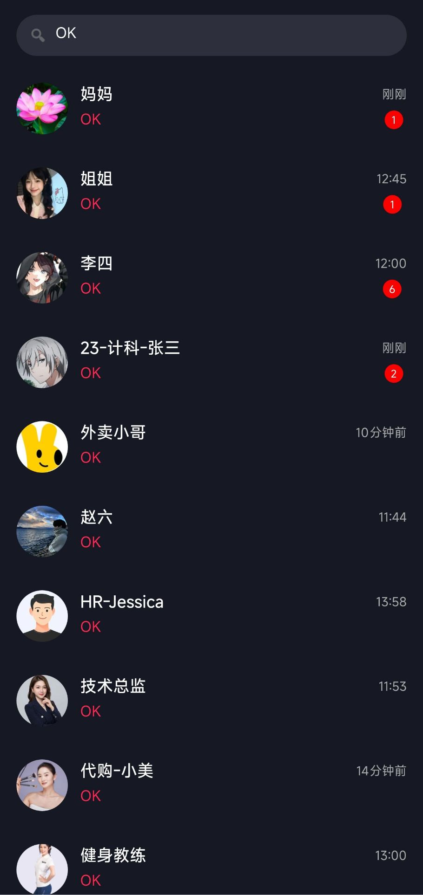
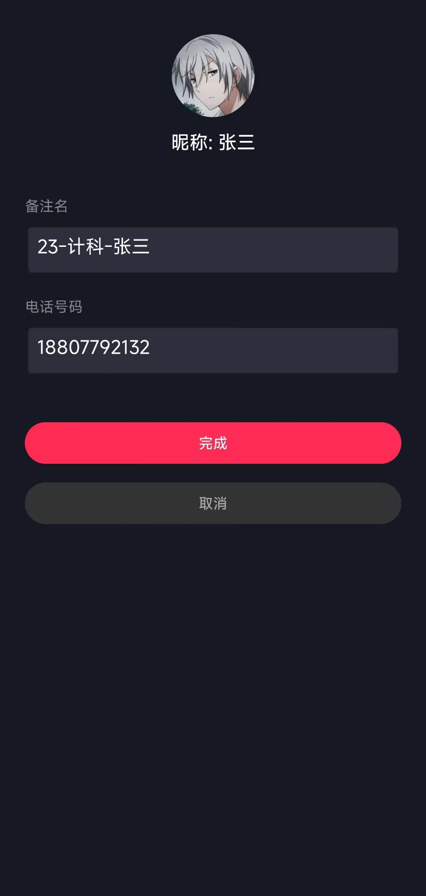

# 抖音简版消息列表

  

本项目是一个高仿抖音（Douyin）客户端消息模块的 Android 应用。项目基于 **MVVM 架构**开发，实现了从消息列表展示、即时通讯模拟、本地数据持久化等核心功能。

-----
## 项目演示

| 首页消息列表 | 聊天对话页面 | 搜索与高亮 |
| :---: | :---: | :---: |
|  |  |  |

| 顶部通知弹窗 | 对话置顶与删除 | 备注设置页 |
| :---: | :---: | :---: |
|  |  |  |

-----

## 工程结构

项目严格遵循模块化分层设计，包结构如下：

```text
com.bytedance.mydouyin
  ├── 📂 model                    // 数据层：实体类与数据仓库
  │    ├── Message.java           // 核心消息实体（支持序列化）
  │    ├── ChatDataHelper.java    // 全局聊天记录缓存仓库（内存数据库）
  │    └── RemarkDatabaseHelper.java // SQLite 数据库帮助类（负责持久化）
  │
  ├── 📂 view          // 视图层：Activity 与 Adapter
  │    ├── MainActivity.java      // 消息列表主页
  │    ├── ChatActivity.java      // 聊天详情页
  │    ├── RemarkActivity.java    // 备注编辑页
  │    ├── MessageAdapter.java    // 列表适配器
  │    └── ChatAdapter.java       // 聊天适配器
  │
  ├── 📂 viewmodel       // 逻辑层：业务逻辑与状态管理
  │    └── MainViewModel.java     // 负责数据加载、模拟消息生成、搜索过滤
  │
  └── 📂 utils           // 工具层
       └── TimeUtils.java         // 时间格式化工具
```

-----

## 环境说明与运行指南

  * **IDE**: Android Studio
  * **Language**: Java 8+
  * **Gradle Plugin**: 8.0+
  * **minSdk**: 24 (Android 7.0)
  * **targetSdk**: 34 (Android 14)

**运行步骤：**

1.  Clone 或下载本项目代码。
2.  在 Android Studio 中打开项目，等待 Gradle Sync 完成。
3.  确保 `assets/data.json` 文件存在。
4.  连接真机或模拟器，点击 **Run** 即可运行。

-----

## 技术方案

### 1\. 架构模式

  * **MVVM**: 使用 `ViewModel` + `LiveData` 实现数据驱动 UI，确保配置变更时数据不丢失，并解耦 UI 逻辑。
  * **ViewBinding**: 替代传统的 `findViewById`，提高代码安全性和开发效率。

### 2\. 核心组件

  * **RecyclerView**: 实现复杂的多类型列表（文本、图片、卡片、Footer）。
  * **SwipeRefreshLayout**: 实现下拉刷新逻辑。
  * **ConstraintLayout**: 实现复杂的嵌套布局（如聊天气泡、卡片）。
  * **CardView**: 实现顶部通知弹窗。

### 3\. 数据存储与处理

  * **SQLite**: 使用原生 `SQLiteOpenHelper` 实现备注、电话、置顶状态的持久化。
  * **Gson**: 解析本地 JSON 模拟初始数据。
  * **Glide**: 高效加载网络图片及本地资源，并处理圆形裁剪。

-----

## 核心功能与难点分析

### 1\. 多线程并发与数据一致性

  * **难点**：后台有一个模拟线程每隔几秒生成新消息并修改列表，同时主线程可能正在进行搜索过滤或刷新 UI，极易导致 `ConcurrentModificationException` 或数据视图不一致。
  * **方案**：
      * 在 `ViewModel` 中通过 `postValue` 将后台数据切换至主线程更新。
      * 在遍历集合时使用快照（Snapshot）模式或 `try-catch` 保护机制。
      * 建立全局单例仓库 `ChatDataHelper`，确保“列表页摘要”与“聊天页历史记录”的数据源强一致性。

### 2\. 复杂的列表交互与多布局

  * **功能**：列表支持 4 种类型展示（文本、图片、运营卡片、Footer 加载条）。
  * **实现**：重写 `getItemViewType`，根据消息类型加载不同的 ViewHolder。实现了“上滑加载更多”的循环数据逻辑，模拟无限列表体验。

### 3\. 沉浸式 UI 与 键盘适配

  * **难点**：在全屏深色主题下，软键盘弹出时往往会遮挡底部的输入框，或者导致标题栏被状态栏遮挡。
  * **方案**：
      * 使用 `android:fitsSystemWindows="true"` 配合 `adjustResize` 模式，实现键盘完美顶起输入框。
      * 使用 `addOnLayoutChangeListener` 监听列表高度变化，键盘弹出时自动将消息列表滚动到底部。

### 4\. 全局搜索与高亮

  * **功能**：支持搜索昵称、备注、卡片标题，历史聊天记录。
  * **实现**：
      * 封装通用的 `filterList` 方法。
      * 利用 `SpannableString` 实现关键词红色高亮。
      * 当搜索命中历史记录时，动态构建“替身消息对象”，将摘要替换为命中的历史内容并展示真实时间。

### 5\. SQLite 数据库平滑升级 (Migration)

  * **功能**：随着版本迭代增加“置顶”和“电话”字段。
  * **实现**：在 `onUpgrade` 中使用 `ALTER TABLE ADD COLUMN` 语法，确保老用户升级 APP 后，原有的备注数据不丢失，同时无缝获得新功能。

-----

## 交互细节

  * **真实时间显示**：自定义 `TimeUtils`，实现“刚刚”、“xx分钟前”、“昨天”等人性化时间格式。
  * **未读数逻辑**：新消息到来自动累加，进入聊天页自动清零。
  * **模拟触达**：后台生成新消息时，若不在搜索状态，顶部会弹出仿 iOS 的通知卡片，点击可直接跳转。

-----

**Author**: 苏芷菱

**Date**: 2025/12/05

